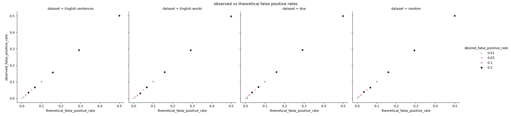
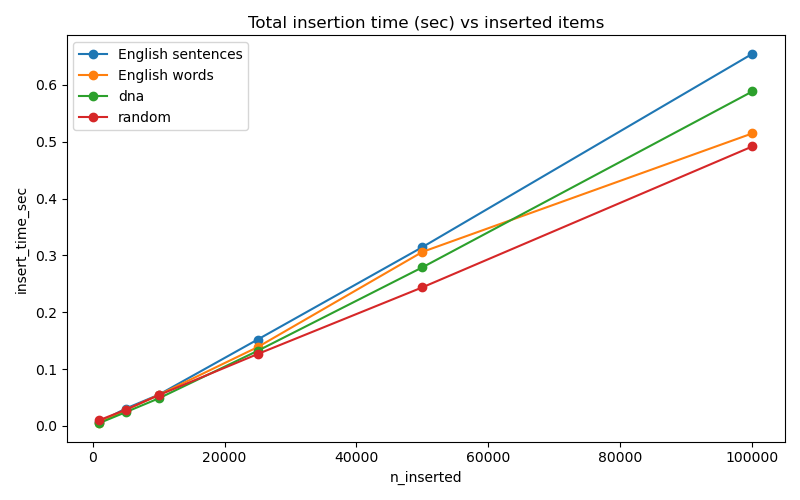
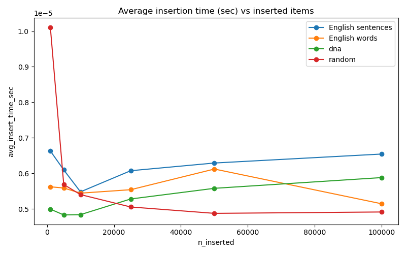
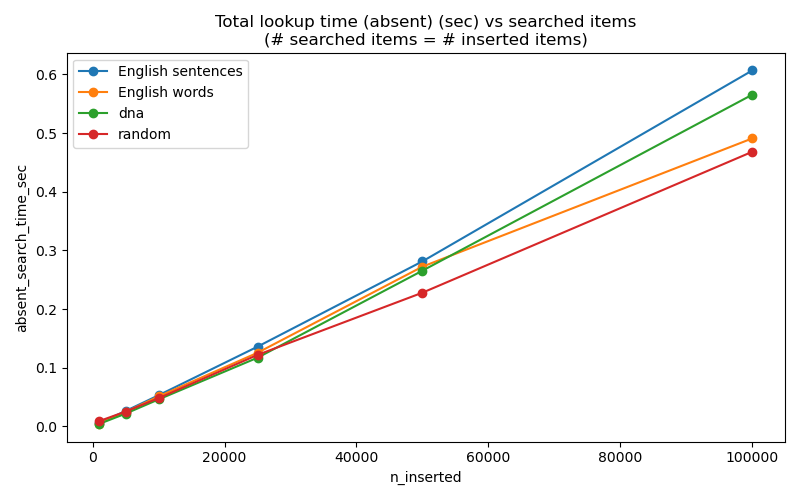
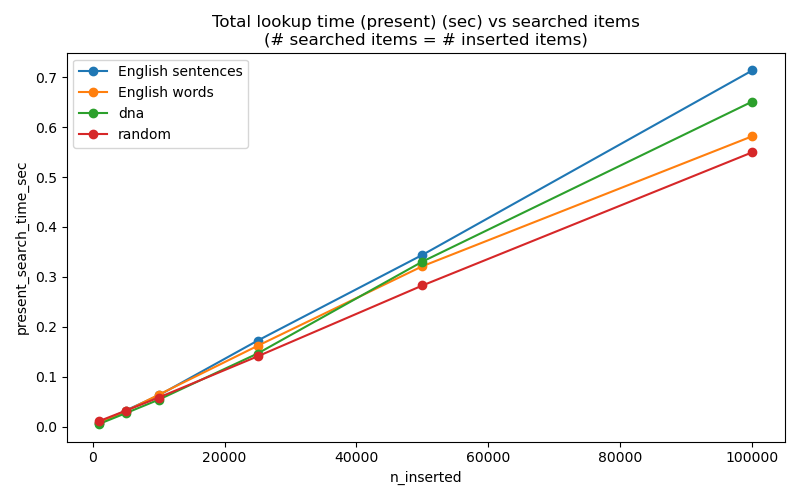
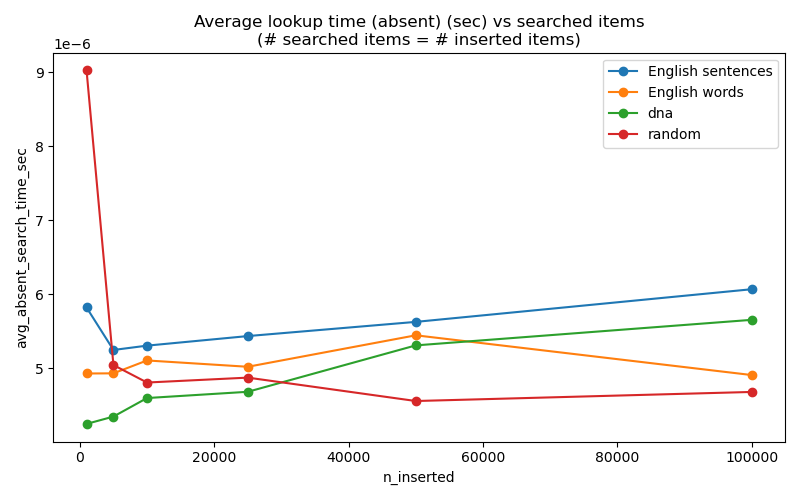
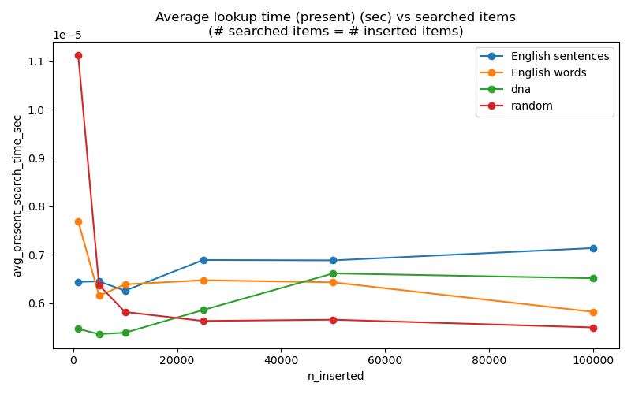
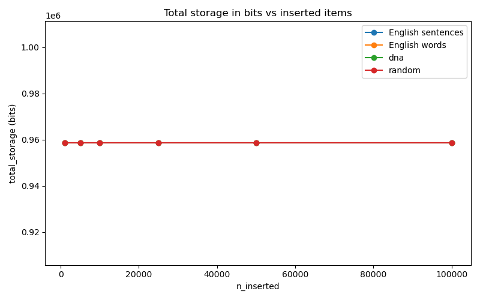
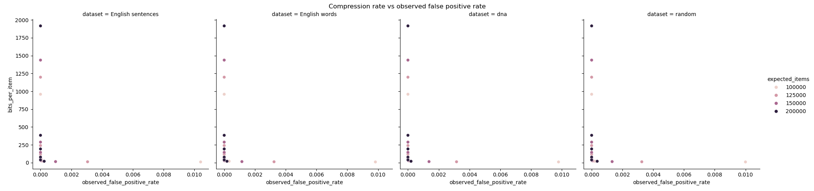
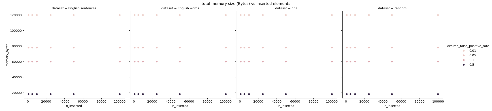

## Contributors
Silas Ooko - 2501260
Saïd De Wolf - 2503710

# Bloom Filter Project (2025–2026)

## Overview

This project outlines the design, implementation, and testing of a Bloom filter, a probabilistic data structure that is used to test data set membership. A Bloom filter, in contrast to more traditional data structures like hash tables or balanced trees, has much faster membership queries, and requires much less memory. This efficiency is achieved by sacrificing a low chance of false positives, while false negatives are theoretically impossible.
This project aimed to implement a fully operational Bloom filter in Python, test its functionality, and understand its performance properties and how its behaviour varies with workloads and input data types. Alongside confirming the theoretical properties of Bloom filters, the project examines more practical considerations in the form of insertion speed, the look-up performance, false positives, storage requirements and compression efficiency. It was implemented on several datasets, consisting of English sentences, English words, DNA sequences, and randomly generated strings, giving a general understanding of the behaviour of Bloom filters with various data types.

## Implementation

Bloom filter was developed as a Python library that is easy to read, maintain, and reproduce. It is implemented in the classical Bloom filter architecture where the fixed-size bit array is used and several hash functions are used. In insertion, an element is hashed by multiple independent hash functions and the relevant bit positions in the bit array are marked as one. Membership queries are executed by computing the same hash functions and checking the existence of all the bits. When any of the bits needed are not set, the element is ensured not to be present in the filter. In case all bits are one, the element is reported as potentially present.
The focus was made to make sure that the implementation is modular and extendible. The code was designed to enable various filter sizes, false positives, and data types to be tested without having to change the underlying algorithm. Implementation also involves benchmarking and evaluation tools that are used to produce experimental results as indicated in this report.
The quality of hash functions used in Bloom filters is a key factor in their performance since bad hash distributions can result in a higher rate of collisions and reduced accuracy. Experiments were conducted on several classes of data with highly structured natural language text to entirely random strings to assess the strength of the implementation. This enabled the project to evaluate the ability of the selected hashing strategy to exhibit the same distribution characteristics under a wide workload.
To ensure code quality, consistency, and correctness, this project utilized tests, branches, workflows, and code reviews.

## Correctness Testing

One important correctness property of a Bloom filter is: after an element has been added, it should never be reported missing. That is, Bloom filters should not give false negatives. The assurance of this guarantee was thus among the main goals of the evaluation stage.
The implementation was thoroughly tested with the introduction of large numbers of elements and then querying each item that was introduced. Other experiments were done with elements that were not ever inserted into the filter in order to test false positive behaviour. These tests were replicated in all categories of datasets and sizes of insertions.
The correctness tests ensured that the Bloom filter was acting as per the expected behavior. All the inserted elements could be correctly found when looked up later, meaning that the implementation properly ensures the theoretical guarantees of the Bloom filter. These experiments provide the basis of more specific performance and accuracy studies which are discussed in the sections which follow.

## Performance Evaluation

The evaluation of the performance of the Bloom filter was based on increasingly larger datasets with one thousand up to one hundred thousand inserted elements. The experiments involved the use of four data sources: English sentences, English words, DNA sequences and randomly generated strings. These datasets were chosen to get the answer to the question whether various input characteristics affected performance or accuracy.
A number of performance parameters were measured such as the insertion time, the lookup time of the existing elements, the lookup time of the missing elements, the observed false positive rate, the theoretically false positive rate, the memory consumption and the compression efficiency. Total execution times, as well as average per-operation costs were logged so as to give a complete picture of the scalability of the filter.
The experimental apparatus was utilized to compare experimental behaviour with the theoretical predictions. This comparison is especially significant to probabilistic data structures since it shows that the implementation is a faithful reflection of the mathematical properties, on which Bloom filters are founded.
But it should be noted that average measured time values tend to vary from run to run at the start. This is a bit unstable, but seems to mainly be an issue of other loads of the computer influencing the startup time of the bloom filter.

## Experimental Results and Analysis
### Correctness Verification

The initial experiments were to confirm that the implementation did not yield any false negatives. Because Bloom filters are created to ensure that the elements inserted are never indicated as missing, a false negative would mean something is wrong with the implementation.


The findings indicate that the false negative count was zero and constant in all datasets and in all sizes of insertions. With either a thousand elements in the filter or a hundred thousand elements, all the items placed in the filter were all identified upon a lookup operation. This gives the confirmation that the implementation is correct, and the process of insertion and membership query were correctly implemented.

### False Positive Behaviour

False positives unlike false negatives are a natural property of Bloom filters. The more bits put in the filter, the more bits are occupied, and the more probable it is that a random element will happen to match all the necessary hash positions.


The false positive rate seen was very small with smaller datasets and slowly rose with the increase in population of the filter. False positives were practically zero when the number of elements to be inserted was less than fifty thousand. When the filter went to one hundred thousand elements inserted, false positive was about one percent. This is all as expected in Bloom filter theory and is a result of the growing saturation of the bit array.
The measured values were also checked against the mathematically predicted false positive rates to establish whether implementation is as per the theory.


According to the theoretical model false positive probability will be steadily increasing with the number of elements added to the filter. The measured values were almost in line with these predictions and it is a good indication that the implementation is acting in the manner that it was predicted.
This relationship is further demonstrated by a direct comparison of the theoretical and observed false positive rates.




The near convergence between experimental and theoretical results shows that the implementation is a good model of the probabilistic behaviour of a Bloom filter. The small discrepancies may be ascribed to statistical fluctuation and limited sampling, but the general consensus is extremely high.
### Insertion Performance

The measure of insertion performance was to record the total time in which an increasing amount of data were inserted into the filter.



The time of insertion was roughly proportional to the size of the number of elements inserted. At the biggest scale measured, one hundred thousand insertions took less than a second of overall run time. This illustrates the fact that the implementation is effectively scaled and is viable over large workloads.
Average insertion time per element was also measured to gain more insight into the computational cost of individual insertions.



The average cost of insertion was insignificantly dependent on dataset size, and was about five to six microseconds per insertion. This is not surprising since each insertion carries out a fixed number of hash calculations irrespective of the amount of elements that have already been stored inside the filter.

### Lookup Performance

The most common operation that is performed on Bloom filters is membership testing, and therefore, the look up performance is of particular importance. Experiments with separate elements were done with an element that was present in the filter and with the elements that were not.




The present and absent lookup operations had virtually linear scaling with the number of queries. Total execution times were very small even with a hundred thousand queries in spite of the increased workloads.
Mean look up costs are more representative of query efficiency.




The mean time to look up was very steady in all experiments, and was generally three to four microseconds per query. The difference in performance between types of datasets was not significant showing that the hash functions spread out values well, irrespective of the structure of the inputs. These results demonstrate one of the key benefits of Bloom filters: incredibly fast membership testing with constant-time complexity.

### Memory Usage and Compression Efficiency

A key feature of Bloom filters is that they can offer approximate testing of membership and much less memory is used than for traditional set-based data structures.



The overall storage demand was the same across the experiments since the Bloom filter assigns its bit array during initiation. Further extensions to bits do not raise memory usage. This predictable memory usage is of great value especially in large-scale systems where memory is a significant factor.
The storage efficiency was also considered by determining the average number of bits to be stored per element.


The fewer bits per item needed decreased significantly as more elements were added to the filter. This illustrates that Bloom filters are more space-efficient as they approach their target operating capacity.
The connection between false positive rate and compression efficiency was also explored.



The findings disclose the traditional Bloom filter trade-off between memory use and accuracy. Reduced false positive rates imply that they consume more memory in the form of larger bit arrays, and thus accept a higher probability of false positives implies smaller compression and reduced storage costs.
Lastly, memory needs were studied under various target false positive rates and dataset sizes.



These findings reveal that with higher accuracy demands, memory usage goes straight to the point of increased memory usage. Lower false positive rate filters need a much bigger bit array, whereas more relaxed accuracy goals can be attained at much less memory. This behaviour is very much in line with the theoretical design equations of Bloom filters.

## HPC Scalability and Cross-Platform Checking.

The results obtained by the HPC experiments were very similar to those obtained in the local system and this proves that the Bloom filter implementation is reliable when scaled to the various computing environments. The maintenance of all the correctness guarantees was monitored, and no false negatives were identified during the assessment. The correlation between the number of insertions, the cost of the lookup and the false positive behaviour was similar to that observed with the local benchmarks with respect to the memory consumption. The size of the workload had an approximately linear effect on both the insertion and lookup times, but the average cost per operation was not significantly affected by the workload size, which validated the anticipated time complexity of the data structure. HPC setup was made with a much higher target capacity, which led to a larger bit array and reduced filter saturation. As a result, the observed false positive rates were actually small with the workloads tested and were very similar to the theoretical values. Even though the HPC platform offered more predictable and uniform execution times, the overall performance characteristics were essentially similar to those found locally. This local-HPC demonstration shows that the implementation is strong, portable, and it can preserve its accuracy, scalability, and efficiency when used in a larger computational environment. The results thus confirm the accuracy of the implementation as well as its applicability to large-scale and data-intensive applications.
## Discussion

Experimental results show that the behavior of the implemented Bloom filter is consistent with the theory for each of the metrics evaluated. Above all, no negative results (false negatives) were seen in any of the experiments, verifying the correctness of the implementation. The measured false positive rates were around the theoretical predictions, further evidence that the hashing strategy and parameter selection were suitable.
The performance measurements showed constant time for both insertion and lookup. The data structure proved to be efficient, even for processing 100 thousand elements, the operation times were in microseconds. The surprise was that the lookup results were very promising: the membership queries continued to be very fast, even with big datasets, even when data was in specific formats.
One other significant benefit of Bloom filters came out of the memory analysis, that is fixed and predictable memory requirement. In contrast to many other traditional data structures, memory usage does not dynamically increase when adding new elements. Rather, the balance between memory consumption and accuracy trade-off during the construction of the filters can be managed using a desired target false positive rate.
From the experiments, one interesting point is that there was very little difference in performance between English text, DNA sequences and random data. This implies that the hash functions are uniform, with no significant preference for any type of input. This implementation thus seems to be appropriate for a wide variety of real-world applications.

## Conclusion

In the end, this project was able to design, implement and test a Bloom filter in Python. The implementation has been tested with a great deal of experimentation and it is demonstrated to meet the basic properties guaranteed by a Bloom filter and it's performance and memory usage are excellent. The results were consistent with no false negative, exhibited near perfect agreement for false positive rates and insertion and lookup remained very fast even for large datasets.
The experiments also emphasized key practical principles on which Bloom filters are useful. The probabilistic false positive rate incurred by Bloom filters is negligible, but can be tolerated, and the query time is constant. They are suited for use in large scale systems like databases, web caching, distributed storage systems, networking systems and data intensive systems.
In general, the project shows the theory and usefulness of the probabilistic data structures. The implementation illustrates the trade-off between accuracy, performance and memory usage, which makes Bloom filters a suitable solution for large-scale membership testing problems.

## Folder structure

```text
.
├── .github/
│   └── workflows/
│       └── code_checks.yml          # Runs checks when merging into main
├── project_bloom/
│   ├── bash/
│   │   └── hpc_job.sh               # HPC benchmarking script
│   ├── conda/
│   │   ├── create_env.slurm         # Creates Conda environment on HPC
│   │   ├── general.yml              # General Conda environment
│   │   ├── hpc_linux.yml            # HPC-specific Linux environment
│   │   └── windows.yml              # Windows environment
│   ├── data/
│   │   ├── hpc/                     # Raw HPC benchmarking data
│   │   └── local/                   # Raw local benchmarking data
│   ├── results/
│   │   ├── hpc/                     # HPC benchmark results and plots
│   │   └── local/                   # Local benchmark results and plots
│   ├── src/                         # Bloom filter source code
│   ├── tests/                       # Unit and integration tests
│   └── setup.py                     # Project setup configuration
├── .gitignore                       # Git ignored files
└── README.md                        # Project documentation
```

## References
- Bird, S., Klein, E., & Loper, E. (2009). Natural language processing with python. O'Reilly Media.
- For sentence and grammar alignment, open AI was used.
