# Bloom Filter Project (2025–2026)

## Proposed README layout (We can clean it)
## Overview

This project outlines the design, implementation, and testing of a Bloom filter, a probabilistic data structure that is used to test data set membership. A Bloom filter, in contrast to more traditional data structures like hash tables or balanced trees, has much faster membership queries, and requires much less memory. This efficiency is achieved by sacrificing a low chance of false positives, even though false negatives are in theory impossible.
This project aimed to implement a fully operational Bloom filter in Python, test its functionality, and understand its performance properties and how its behaviour varies with workloads and input data types. Alongside confirming the theoretical properties of Bloom filters, the project examines more practical considerations in the form of insertion speed, the look-up performance, false positives, storage requirements and compression efficiency. It was implemented on several datasets, consisting of English sentences, English words, DNA sequences, and randomly generated strings, giving a general understanding of the behaviour of Bloom filters with various data types.

## Implementation

Bloom filter was developed as a Python library that is easy to read, maintain, and reproduce. It is implemented in the classical Bloom filter architecture where the fixed-size bit array is used and several hash functions are used. In insertion, an element is hashed by multiple independent hash functions and the relevant bit positions in the bit array are marked as one. Membership queries are executed by computing the same hash functions and checking the existence of all the bits. When any of the bits needed are not set, the element is ensured not to be present in the filter. In case all bits are on, the element is reported as potentially present.
The focus was made to make sure that the implementation is modular and extendible. The code was designed to enable various filter sizes, false positives, and data types to be tested without having to change the underlying algorithm. Implementation also involves benchmarking and evaluation tools that are used to produce experimental results as indicated in this report.
The quality of hash functions used in Bloom filters is a key factor in their performance since bad hash distributions can result in a higher rate of collisions and reduced accuracy. Experiments were conducted on several classes of data with highly structured natural language text to entirely random strings to assess the strength of the implementation. This enabled the project to evaluate the ability of the selected hashing strategy to exhibit the same distribution characteristics under a wide workload.

## Correctness Testing

One important correctness property of a Bloom filter is: after an element has been added, it should never be reported missing. That is, Bloom filters should not give false negatives. The assurance of this guarantee was thus among the main goals of the evaluation stage.
The implementation was thoroughly tested with the introduction of large numbers of elements and then querying each item that was introduced. Other experiments were done with elements that were not ever inserted into the filter in order to test false positive behaviour. These tests were replicated in all categories of datasets and sizes of insertions.
The correctness tests ensured that the Bloom filter was acting as per the expected behavior. All the inserted elements could be correctly found when looked up later, meaning that the implementation properly ensures the theoretical guarantees of the Bloom filter. These experiments provide the basis of more specific performance and accuracy studies which are discussed in the sections which follow.

## Performance Evaluation

The evaluation of the performance of the Bloom filter was based on increasingly larger datasets with one thousand up to one hundred thousand inserted elements. The experiments involved the use of four data sources: English sentences, English words, DNA sequences and randomly generated strings. These datasets were chosen to get the answer to the question whether various input characteristics affected performance or accuracy.
A number of performance parameters were measured such as the insertion time, the lookup time of the existing elements, the lookup time of the missing elements, the observed false positive rate, the theoretically false positive rate, the memory consumption and the compression efficiency. Total execution times, as well as average per-operation costs were logged so as to give a complete picture of the scalability of the filter.
The experimental apparatus was utilized to compare experimental behaviour with the theoretical predictions. This comparison is especially significant to probabilistic data structures since it shows that the implementation is a faithful reflection of the mathematical properties, on which Bloom filters are founded.
## Experimental Results and Analysis
### Correctness Verification

The initial experiments were to confirm that the implementation did not yield any false negatives. Because Bloom filters are created to ensure that the elements inserted are never indicated as missing, a false negative would mean something is wrong with the implementation.
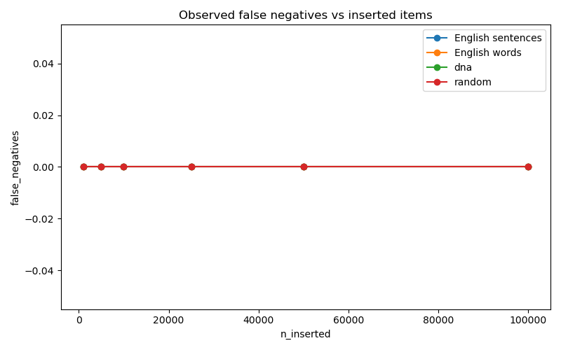
The findings indicate that the false negative count was zero and constant in all datasets and in all sizes of insertions. With either a thousand elements in the filter or a hundred thousand elements, all the items placed in the filter were all identified upon a lookup operation. This gives the confirmation that the implementation is correct, and the process of insertion and membership query were correctly implemented.

### False Positive Behaviour

False positives unlike false negatives are a natural property of Bloom filters. The more bits put in the filter, the more bits are occupied, and the more probable it is that a random element will happen to match all the necessary hash positions.
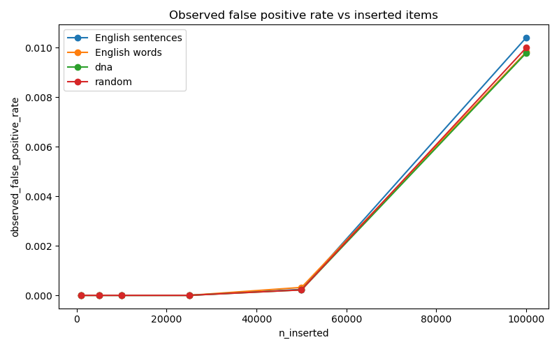

The false positive rate seen was very small with smaller datasets and slowly rose with the increase in population of the filter. False positives were practically zero when the number of elements to be inserted was less than fifty thousand. When the filter went to one hundred thousand elements inserted, false positive was about one percent. This is all as expected in Bloom filter theory and is a result of the growing saturation of the bit array.
The measured values were also checked against the mathematically predicted false positive rates to establish whether implementation is as per the theory.

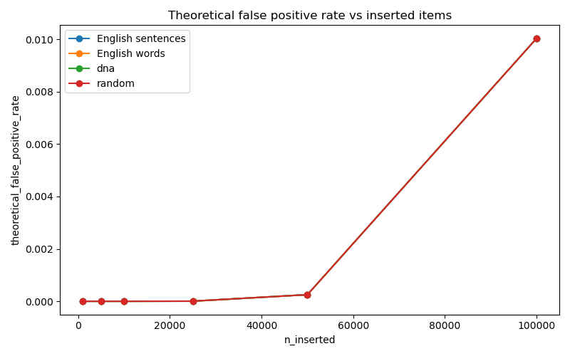
According to the theoretical model false positive probability will be steadily increasing with the number of elements added to the filter. The measured values were almost in line with these predictions and it is a good indication that the implementation is acting in the manner that it was predicted.
This relationship is further demonstrated by a direct comparison of the theoretical and observed false positive rates.
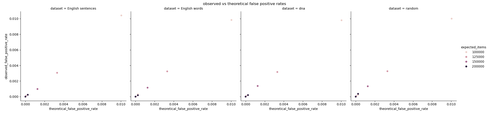

The near convergence between experimental and theoretical results shows that the implementation is a good model of the probabilistic behaviour of a Bloom filter. The small discrepancies may be ascribed to statistical fluctuation and limited sampling, but the general consensus is extremely high.
### Insertion Performance

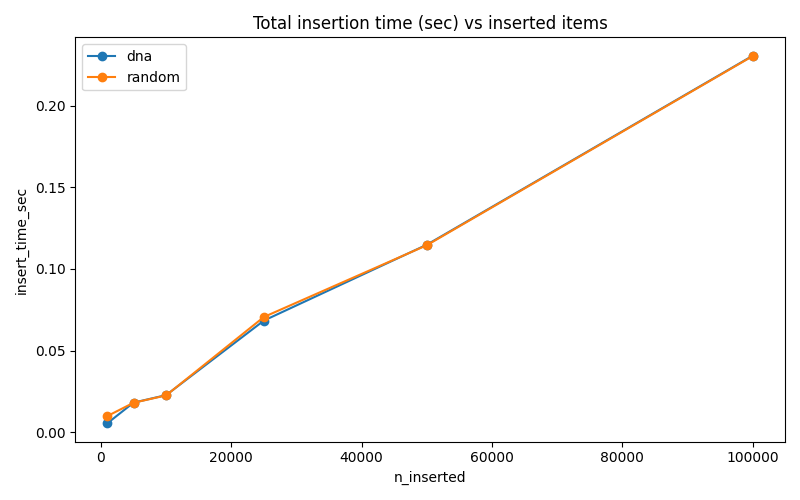
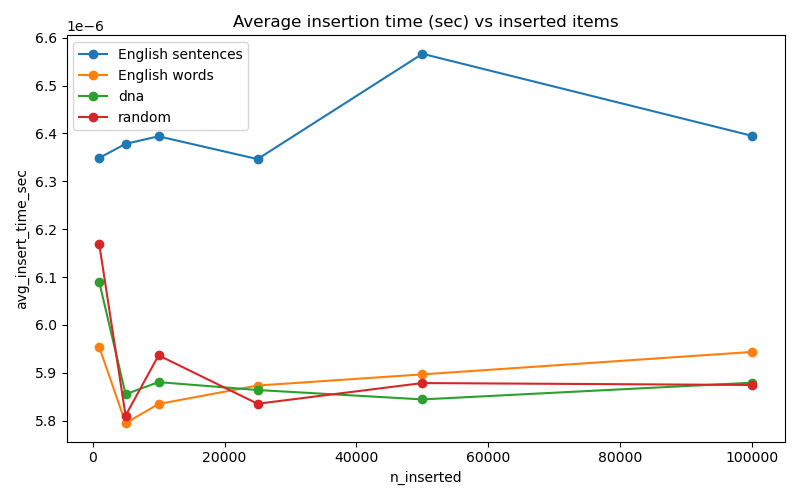

### Lookup Performance

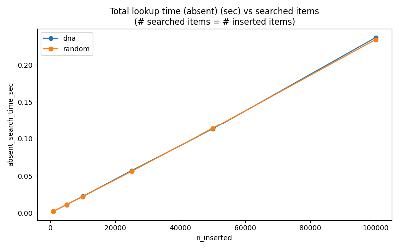
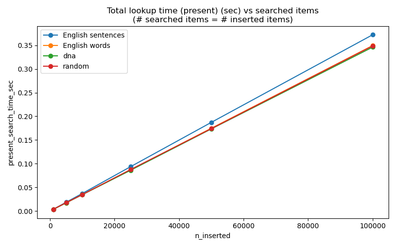

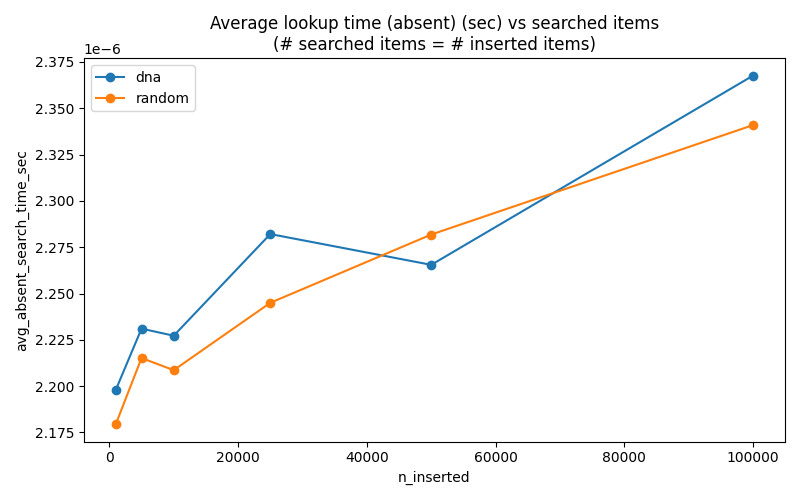
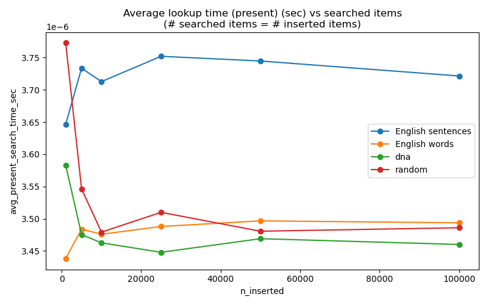

### Memory Usage and Compression Efficiency

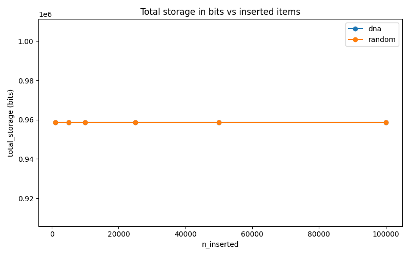
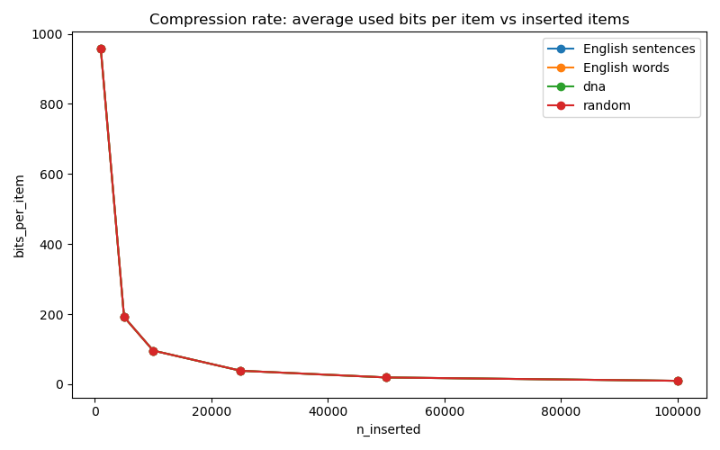
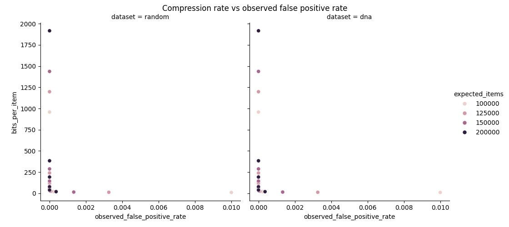
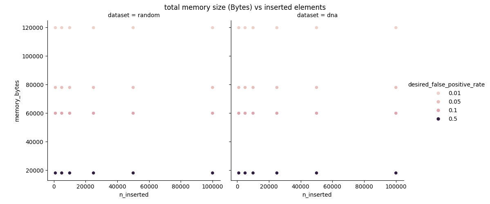

## Discussion
## Conclusion
## References
- Bird, S., Klein, E., & Loper, E. (2009). Natural language processing with python. O'Reilly Media.
